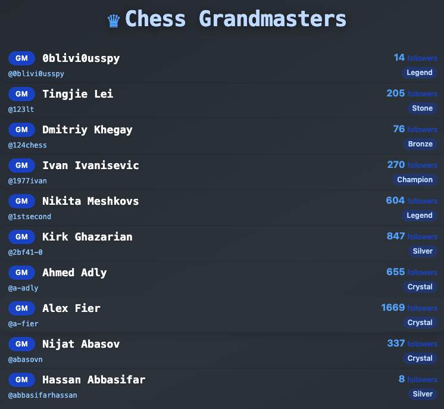
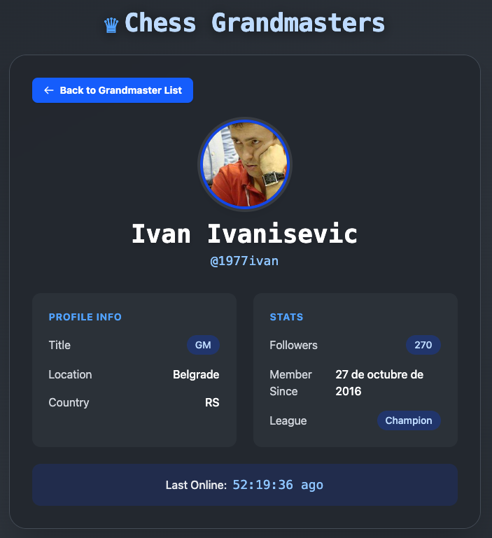
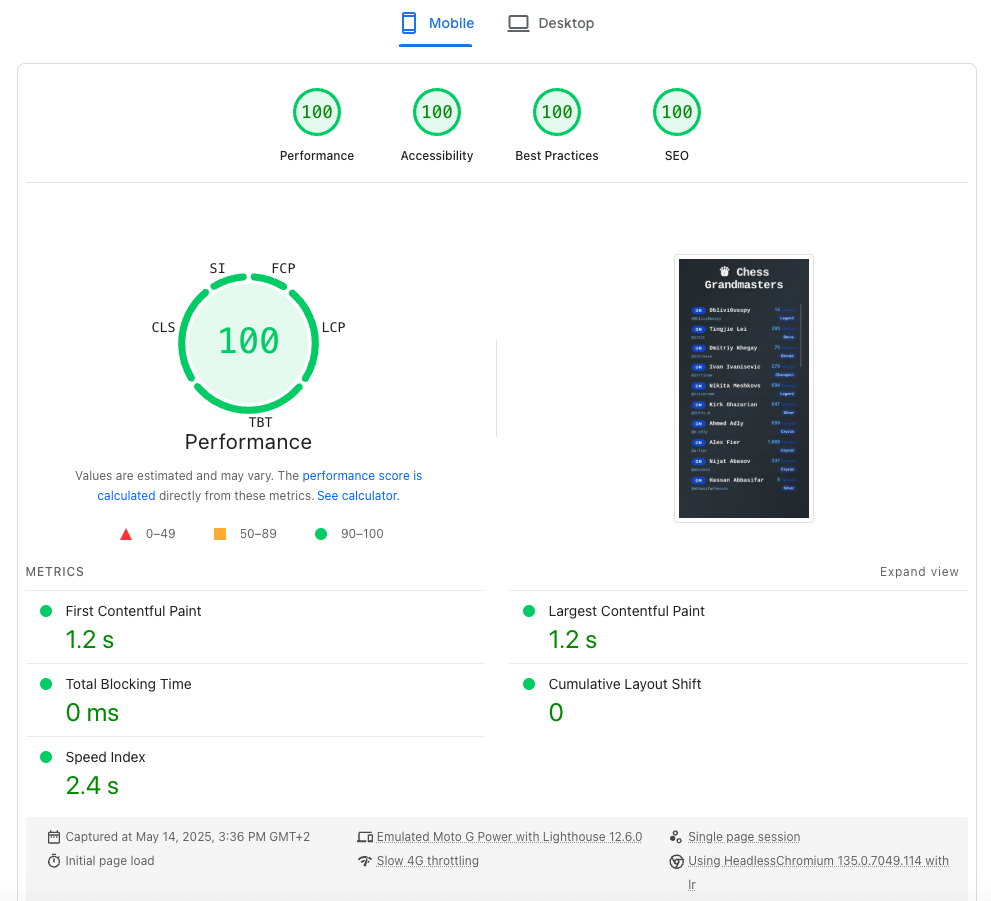

# ♛ Chess Grandmasters Directory

[](https://chess-grandmasters-codechallenge.vercel.app/)
[](https://vitejs.dev/)
[](https://playwright.dev/)
[](https://vitest.dev/)

## Description

A modern, high-performance, accessible, and fully tested directory of chess grandmasters. Explore detailed profiles with smooth infinite scroll navigation.

---

## 🚀 Demo

[Live Demo on Vercel](https://chess-grandmasters-codechallenge.vercel.app/)

---

## 📸 Screenshots

| List View                                     | Profile View                                        |
| --------------------------------------------- | --------------------------------------------------- |
|  |  |

---

## ✨ Features

- **Instant LCP**: Main heading renders immediately for best performance.
- **Virtualized List**: Handles thousands of grandmasters with react-window for smooth scrolling.
- **Scroll Restoration**: Remembers your scroll position when navigating between list and profile.
- **Lazy Loading**: List content is lazy-loaded for fast initial paint.
- **Responsive Design**: Looks great on desktop, tablet, and mobile.
- **Dark Theme**: Modern, accessible, and visually appealing.
- **Error & Loading States**: User-friendly feedback for all states.
- **Accessibility**: Keyboard navigation, semantic HTML, and color contrast.
- **SEO Optimized**: Meta tags, robots.txt, manifest, and more.
- **100% Lighthouse Score**: Performance, Accessibility, Best Practices, SEO.
- **Comprehensive Testing**: Unit (Vitest), E2E (Playwright), and coverage.
- **Local cache for paginated data**: List data is cached in localStorage for fast navigation and reduced API calls, with automatic cache expiration for freshness.

---

## 🛠 Tech Stack

- **React 19** (with Suspense, lazy, hooks)
- **TypeScript**
- **Vite** (blazing fast dev/build)
- **Tailwind CSS** (utility-first styling)
- **react-window** (virtualized list)
- **Playwright** (E2E tests)
- **Vitest** (unit/integration tests)
- **React Testing Library**
- **ESLint, Prettier** (code quality)

---

## ⚡ Getting Started

```bash
# 1. Clone the repo
$ git clone https://github.com/carlosruana/chess-grandmasters-codechallenge.git
$ cd chess-grandmasters-codechallenge

# 2. Install dependencies
$ npm install

# 3. Start the dev server
$ npm run dev

# 4. Run tests
$ npm test           # Unit tests
$ npm run test:e2e   # Playwright E2E tests
```

---

## 🧠 Decisions & Trade-offs

- **Virtualized List**: Chosen for performance with large datasets, but makes some a11y and testing scenarios more complex.
- **Scroll Restoration**: Uses sessionStorage for reliability across navigation.
- **Lazy Loading**: Only the list content is lazy-loaded, not the heading, to optimize LCP.
- **Dark Theme**: Prioritized for modern look and accessibility, but can be extended for light mode.
- **Testing**: Focused on both unit and E2E for confidence, but some edge cases (e.g., network errors) are simulated.

---

## 📈 PageSpeed Insights

This application scores **100%** in Performance, Accessibility, Best Practices, and SEO on Google Lighthouse (both mobile and Desktop version):



---

## 🐞 Known Issues / Limitations

- Some screen readers may have minor issues with virtualized lists (common with react-window).
- No pagination or search (could be added for larger datasets).

---

## 🔮 Future Improvements

- **Add more exhaustive testing**: Expand unit, integration, and end-to-end tests to cover edge cases, error boundaries, and loading states.
- **Move pagination to the server**: Offloading pagination logic to the backend would reduce client memory usage and improve performance on large datasets. This also enables advanced features like search, sorting, and filtering, since the server can efficiently query and return only the relevant data for each user request.
- **Implement server-side rendering (SSR)**: Leveraging SSR (e.g., with Next.js or Vite SSR) could significantly improve time-to-content (especially LCP) and SEO. SSR also makes it easier to implement features like search engine-friendly URLs, server-driven search, and pre-sorted or filtered results, as the server can render the correct state for any incoming request.
- **Preload high-priority content**: Preloading likely-to-be-visited grandmaster profiles or the first visible items could improve perceived performance.
- **Add skeleton loaders**: Use skeleton UIs instead of spinners for a smoother and more modern loading experience.

---

## 📋 Other Notes

- **Accessibility**: All interactive elements are keyboard accessible. Color contrast meets WCAG AA.
- **Performance**: LCP, FCP, and TTI are all optimized for instant load.
- **SEO**: robots.txt, manifest.json, and meta tags included.
- **Dev Experience**: Pre-configured scripts for linting, formatting, and testing.

---

## © 2025 Chess Grandmasters Directory
